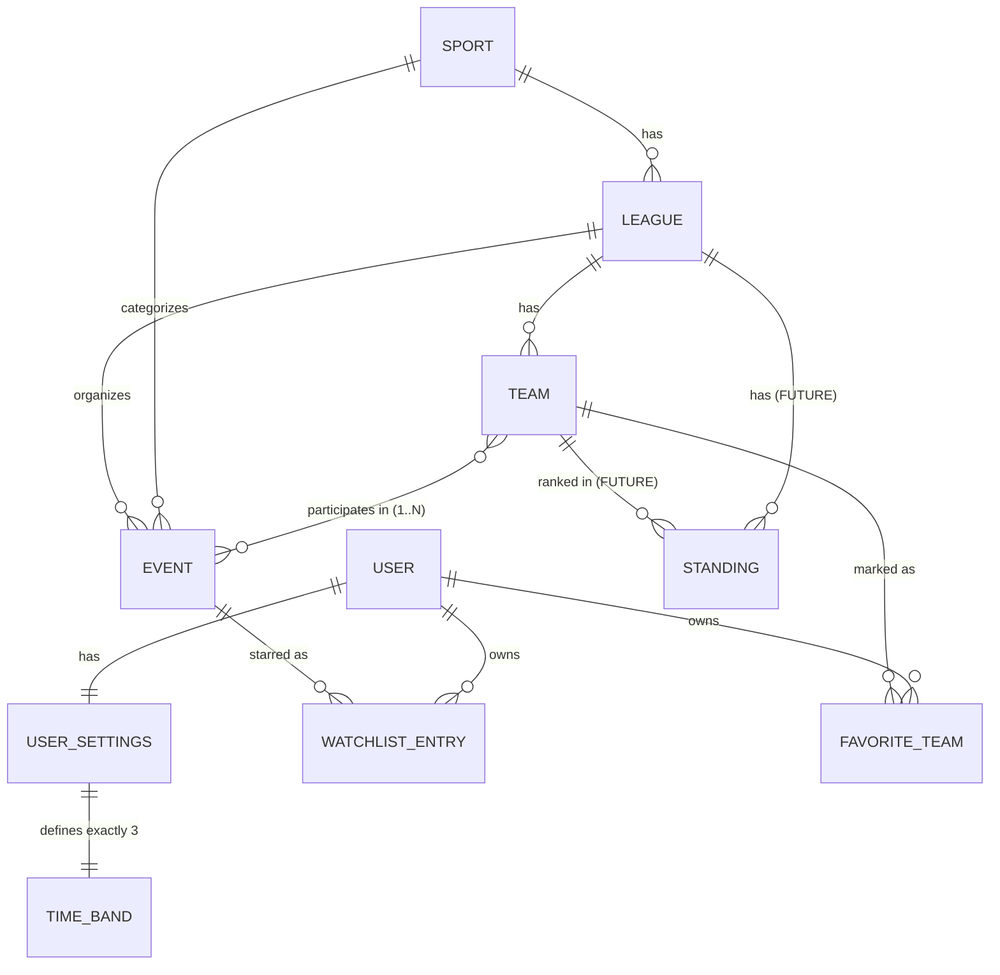

# Entity Map

Wynik `proto-deepen`. Terminy zgodne z `GLOSSARY.md`; nazwy encji po angielsku — to przyszłe identyfikatory w kodzie.

## Diagram

## Entities

### USER (jawne: anonimowy gość)
**Description**: Nie ma kont — "użytkownik" to pojęcie niejawne: przeglądarka z localStorage. Jedyne, co posiada, wymienione poniżej.
**Instances per user**: 1 (na przeglądarkę)
**Ownership**: self
**Lifecycle**: żyje dopóki żyje localStorage; czyszczenie danych przeglądarki = "nowy user"
**States**: brak

### SPORT
**Description**: Najwyższy poziom hierarchii informacji. Katalog startowy: hokej, koszykówka, futbol amerykański, baseball, piłka nożna, motorsport, siatkówka. Posiada ikonę/emoji do rozpoznania z daleka.
**Instances per user**: współdzielone (katalog systemowy)
**Ownership**: System (dane z API/źródła)
**Lifecycle**: pojawia się, gdy źródło danych je obsługuje; live od początku istnienia aplikacji
**States**: brak (nie znika — może być nieobecne w danych)
**Contains**: leagues
**Belongs to**: —

### LEAGUE
**Description**: Seria rozgrywkowa w ramach sportu: NBA, NHL, NFL, MLB, Ekstraklasa, PlusLiga…; w motorsporcie rolę ligi pełni seria wyścigowa (F1, NASCAR, WRC). Jeden poziom hierarchii, jedna nazwa w kodzie.
**Instances per user**: współdzielone
**Ownership**: System
**Lifecycle**: jak Sport
**Contains**: teams
**Belongs to**: Sport

### TEAM
**Description**: Uczestnik zespołowy wydarzenia (w motorsporcie — zespół/stajnia). Wejściem do terminarza sezonu: sport → liga → drużyna.
**Instances per user**: współdzielone
**Ownership**: System
**Lifecycle**: jak Sport (sezonowo odnawiana lista)
**Belongs to**: League
**Views**: SeasonSchedule (pełny terminarz drużyny — widok na Eventach, nie osobna encja)

### EVENT
**Description**: Pojedyncze wydarzenie sportowe: sport, liga, uczestnicy (1..N drużyn — 2 w sportach zespołowych, ~20 w motorsporcie), data i godzina startu (UTC, prezentowana w Timezone użytkownika), status. W motorsporcie jedna sesja (trening/kwalifikacje/wyścig) = jeden Event (granularność — open question z PROJECT.md).
**Instances per user**: współdzielone; tysiące na sezon
**Ownership**: System
**Lifecycle**: tworzy go feed danych; żyje do wypadnięcia z zakresów dat i danych źródła
**States**:
- `scheduled` → `live` → `finished` (naturalny bieg)
- `scheduled` → `postponed` — rodzi **nową instancję** Event z nowym terminem; stara znika z feedu
- `scheduled` → `canceled` — domykanie z feedu, wyciszone
**Contains**: uczestnicy (referencje do Team)
**Belongs to**: Sport, League

### USER_SETTINGS
**Description**: Cała konfiguracja użytkownika: strefa czasowa + dokładnie 3 TimeBandy z edytowalnymi zakresami godzin + preferencja trybu widoku listy wydarzeń.
**Instances per user**: 1
**Ownership**: User (localStorage)
**Lifecycle**: istnieją wartości domyślne (implicit) jeszcze przed pierwszą edycją; zapis dopiero przy zmianie
**States**: brak (implicit → saved)
**Contains**: 3 × TimeBand, timezone, viewMode (`'list' | 'cards'`, default `'list'` — ADR-0006)

### TIME_BAND
**Description**: Pasmo godzinowe z zakresem i kolorem. Domyślnie: Dzień 6:00–22:00, Wieczór 22:00–24:00, Noc 0:00–6:00. Edytowalne wyłącznie dwiema granicami (Day starts / Evening starts); Noc zawsze zaczyna się o północy — pasma zawsze pokrywają całą dobę bez luk i nakładek (ADR-0025). Służy do filtrowania (zasada uniwersalna: **każda lista w aplikacji filtruje się po pasmach**) i wizualnej klasyfikacji "da się obejrzeć" vs "w nocy". Klasyfikacja pasma wydarzenia: po **czasie startu**. Zdarzenia z pasa Night prezentują się pod **wieczorem dnia poprzedniego** (ViewingDay — ADR-0004).
**Instances per user**: dokładnie 3 (w USER_SETTINGS)
**Ownership**: User
**Lifecycle**: jak UserSettings
**States**: brak
**Belongs to**: UserSettings

### WATCHLIST_ENTRY
**Description**: Obserwowane wydarzenie: gwiazdka na Evencie. Lista ma dwie strefy: nadchodzące oraz zwiniętą sekcję przeszłych na dole (nic nie ginie, nic nie trzeba sprzątać ręcznie).
**Instances per user**: wiele
**Ownership**: User (localStorage)
**Lifecycle**: powstaje przy gwiazdce, znika przy odgwiazdkowaniu; nigdy nie wygasa sama
**States**: `upcoming` → `past` (automatycznie, po zakończeniu wydarzenia) → `removed` (ręcznie)
**Belongs to**: User, referencja do Event

### FAVORITE_TEAM
**Description**: Ulubiona drużyna. Trzy zachowania: (1) wyróżnienie jej wydarzeń — serduszko ♥ na wierszach/kartach + chip "N my teams" w nagłówkach dnia (ADR-0034), (2) szybki dostęp do terminarza sezonu bez szukania, (3) filtr "tylko moje drużyny" jednym klikiem.
**Instances per user**: wiele
**Ownership**: User (localStorage)
**Lifecycle**: powstaje przy "ulubieniu", znika przy usunięciu
**States**: brak (binarna: jest / nie ma)
**Belongs to**: User, referencja do Team

### STANDING *(przyszłościowa — poza v1)*
**Description**: Pozycja drużyny w tabeli ligi; miałaby służyć do oceny atrakcyjności wydarzenia (np. ranking meczu "top 5 vs top 6"). Świadomie odroczone.
**Ownership**: System
**Belongs to**: League, Team
