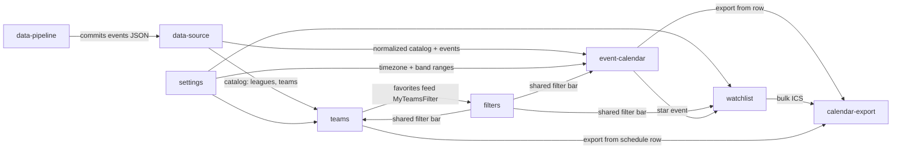

# Module Breakdown

Wynik `proto-strategize`. Synteza PROJECT.md + ENTITY_MAP.md + ACTIONS.md w moduły projektowe. Nazwy modułów po angielsku — to przyszłe nazwy folderów/przestrzeni kodu.

## Overview

Aplikacja rozkłada się na 8 modułów: jeden główny widok (kalendarz tygodnia), wspólne filtrowanie, dwie "posiadane" listy użytkownika (watchlista, ulubione drużyny), eksport do kalendarzy, ustawienia oraz dwie warstwy danych: pipeline generujący statyczne dane (GitHub Action) i cienka warstwa kliencka je czytająca.

**Rozstrzygnięte otwarte pytanie o źródło danych (z PROJECT.md):** v1 = scraping/pobieranie terminarzy przez `data-pipeline` (GitHub Action na cronie) commitujący statyczny JSON do repo. Strona na GH Pages czyta JSON — bez backendu, bez CORS, bez limitów API w przeglądarce. Statusy `live`/`finished` wyliczane klientowo z godziny startu (start ≤ teraz < start+3h → trwa). Live API możliwe w przyszłości.

**Zakres lig v1 — 5 sportów, 8 lig** (po hierarchii sport → liga):

| Sport | Ligi v1 | Później |
|---|---|---|
| 🏒 Hokej | NHL | — |
| 🏀 Koszykówka | NBA | — |
| 🏈 Futbol amerykański | NFL | — |
| ⚽ Piłka nożna | Premier League, Serie A, Bundesliga, La Liga | inne ligi |
| 🏁 Motorsport | F1 | NASCAR, WRC |
| 🏐 Siatkówka | — (później) | PlusLiga |
| ⚾ Baseball | — (później) | MLB |

## Modules

### event-calendar
**Type**: Core
**Description**: Główny widok aplikacji — tygodniowa lista wydarzeń ze wszystkich sportów w strefie czasowej użytkownika, z pasmową klasyfikacją kolorystyczną (dzień/wieczór/noc) i zdyskretowaną sekcją nocy. Wiersz wydarzenia: emoji sportu, uczestnicy, godzina, status. To bezpośrednia odpowiedź na główny problem z PROJECT.md ("co w tym tygodniu da się obejrzeć po ludzku").
**Entities**: `Event` (odczyt), `Sport`, `League`
**Key Actions**: Browse week list; Expand/collapse night section; See event status; Star event; Export single → calendar; Go to team schedule
**Connects to**: filters (przyjmuje wspólny pasek filtrowania), watchlist (gwiazdka z wiersza), calendar-export (przycisk w wierszu), data-source (dane), settings (strefa + pasma)
**Design priority**: High — to jest produkt; klasyfikacja pasmowa to kluczowy insight

### filters
**Type**: Supporting (wysoki priorytet)
**Description**: Wspólny pasek filtrowania realizowany na każdej liście (zasada uniwersalna z ACTIONS.md): sport → liga → drużyna → pasmo godzinowe → zakres dat, plus toggle `MyTeamsFilter`. Musi udźwignąć 5 wymiarów bez bałaganu.
**Entities**: brak własnych; czyta katalog (Sport/League/Team) i `FavoriteTeam`
**Key Actions**: Filter list (wszystkie wymiary); Toggle "only my teams"
**Connects to**: event-calendar, teams (season schedule), watchlist — wszędzie ten sam komponent; teams (źródło ulubionych dla MyTeamsFilter)
**Design priority**: High — drugi najbardziej designowo wrażliwy obszar

### watchlist
**Type**: Core (domyka pętlę użytkownika)
**Description**: Lista obserwowanych wydarzeń: sekcja nadchodzących + automatycznie zwinięta sekcja przeszłych na dole. Gwiazdkowanie z dowolnej listy.
**Entities**: `WatchlistEntry`
**Key Actions**: View watchlist; Expand past section; Remove entry; Export whole watchlist → calendar (ICS); Jump to event
**Connects to**: event-calendar (gwiazdka w wierszu), calendar-export (bulk ICS), filters (wspólny pasek)
**Design priority**: Medium

### calendar-export
**Type**: Supporting
**Description**: Eksport wydarzeń do zewnętrznych kalendarzy: Google Calendar (link z template URL), Apple Calendar (plik ICS). Pojedynczo z dowolnego wiersza wydarzenia + zbiorczo z watchlisty. Domyka cel społeczny ("umów się z kolegą z wyprzedzeniem").
**Entities**: brak własnych (akcja na `Event`/`WatchlistEntry`)
**Key Actions**: Export single → Google Calendar; Export single → Apple Calendar; Export whole watchlist
**Connects to**: event-calendar, watchlist, teams (season schedule) — wszędzie ten sam zestaw akcji wiersza
**Design priority**: Medium — mały moduł, ale musi działać niezawodnie

### teams
**Type**: Core #2
**Description**: Nawigacja po katalogu sport → liga → drużyna, pełny terminarz sezonu drużyny (filtrowalny pasmami), oraz ulubione drużyny z trzema zachowaniami: podświetlenie na głównej liście, szybki dostęp do terminarza, filtr "tylko moje drużyny".
**Entities**: `Team`, `FavoriteTeam`
**Key Actions**: Browse teams; View season schedule; Add/Remove favorite team; (pasywnie) highlight + quick access
**Connects to**: filters (MyTeamsFilter, wspólny pasek na terminarzu), event-calendar (podświetlenia, link "go to team schedule"), calendar-export (wiersze terminarza), data-source (katalog)
**Design priority**: High — drugi główny widok, cel "planowania z wyprzedzeniem"

### settings
**Type**: Generic
**Description**: Konfiguracja użytkownika: strefa czasowa, zakresy godzin trzech pasm (`TimeBand`), reset do domyślnych. Wartości domyślne działają przed pierwszą edycją (implicit).
**Entities**: `UserSettings`, `TimeBand`
**Key Actions**: Change timezone; Edit band ranges; Reset to defaults
**Connects to**: event-calendar, watchlist, teams — każda prezentacja godzin czyta strefę i pasma stąd
**Design priority**: Low-Medium — prosty, ale pasma napędzają cały system wizualny

### data-source
**Type**: Generic
**Description**: Cienka warstwa kliencka: wczytanie statycznego JSON z danymi, normalizacja do encji (`Sport`, `League`, `Team`, `Event`), wyliczenie statusów z czasu (scheduled/live/finished), cache. Jedyny dostawca danych dla UI.
**Entities**: wszystkie katalogowe (odczyt, forma znormalizowana)
**Key Actions**: brak akcji użytkownika (infrastruktura)
**Connects to**: data-pipeline (konsument jego JSON), event-calendar/teams/filters (dostawca danych)
**Design priority**: Medium — mała, ale kontrakt JSON musi być stabilny, zanim powstaną inne moduły

### data-pipeline
**Type**: Generic — największe ryzyko techniczne
**Description**: GitHub Action na cronie: pobiera/scrapuje terminarze lig v1 (NHL, NBA, NFL, F1, Premier League, Serie A, Bundesliga, La Liga), normalizuje do wspólnego schematu JSON i commituje do repo. Utrzymuje aktualność danych bez backendu. Scrapery mają tendencję do rdzewienia — to długoterminowo najkruchszy element systemu.
**Entities**: produkuje dane dla całego katalogu
**Key Actions**: brak akcji użytkownika (CI)
**Connects to**: data-source (produkuje jego wejście)
**Design priority**: High (ryzyko) — wymaga wczesnego spike'u; prototypowanie na mockach idzie równolegle

---

## Integration Map

## Prototyping Order

1. **event-calendar** — rdzeń; wszystko inne wisi o jego wiersz i listę
2. **filters** — bez paska filtrowania kalendarz nie jest użyteczny (pasma!)
3. **watchlist** — domyka pętlę "zobaczysz → oznacz → wróć"
4. **calendar-export** — mały, kończy cel społeczny
5. **teams** — drugi główny widok (terminarz sezonu + ulubione)
6. **settings** — konfiguracja po tym, jak jest co konfigurować
7. **data-source** — kontrakt JSON stabilizowany od początku przez mocki

**Równolegle od startu:** **data-pipeline** spike (weryfikacja: da się scrapować/pobierać te 8 lig w GitHub Action?) — ryzyko techniczne #1; prototyp nie może na nim czekać, ale deploy tak.

## Priority Areas

- **event-calendar × pasma**: kluczowy insight produktu — "da się obejrzeć w dzień" vs "noc". Najbardziej designowo wrażliwy obszar: kolory pasm, mechanika zwinięcia nocy, hierarchia dnia.
- **filters**: 5 wymiarów + toggle w jednym pasku bez przytłoczenia; hierarchia sport → liga musi być czytelna.
- **data-pipeline**: największe ryzyko długoterminowe (rdzewienie scraperów, zmiany źródeł). Wymaga monitoringu/alertów od pierwszego dnia.
